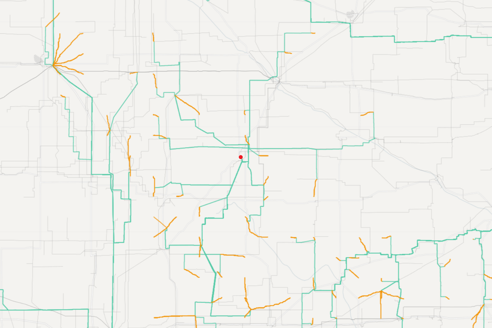

# Least Cost Transmission Paths
Determine least cost transmission paths from land-based and offshore wind and solar farms (supply curve (SC) points) to the electrical grid. Available components of the electrical grid are substations, transmission lines, load centers and infinite sinks. The code only attempts to connect to a point on the transmission line closest to the SC point.

## Files
### Python command-line interface (CLI) files
* [`transmission_layer_creator_cli.py`](transmission_layer_creator_cli.py) - Create all layers for a transmission routing analysis: barriers, friction, and wet costs. If `reVX` has been installed with `pip`, the CLI command alias `transmission-layer-creator` is available for this file. Usage is discussed below.
* [`least_cost_paths_cli.py`](least_cost_paths_cli.py) - Calculate least cost paths between a set of points. CLI alias: `least-cost-paths`
* [`least_cost_xmission_cli.py`](least_cost_xmission_cli.py) - Calculate least cost transmission paths and connection costs. CLI alias: `least-cost-xmission`


### Other notable Python files
* [`trans_cap_costs.py`](trans_cap_costs.py) - Determine paths and costs for a single SC point
	* `TieLineCosts` - Determine least cost paths and transmission costs from SC point to multiple transmission grid elements using [`skimage.graph.MCP_Geogetric`](https://scikit-image.org/docs/stable/api/skimage.graph.html#mcp-geometric)
	* `TransCapCosts` - Determine total transmission cost including line cost and any substation construction or improvements.
* [`least_cost_xmission.py`](least_cost_xmission.py) - Calculate costs from SC points to transmission features. By default, all SC points are used or a subset may be specified by GID.
* [`least_cost_paths.py`](least_cost_paths.py) - Parent class for `least_cost_xmission.py`.

# Layer Creation
Calculating transmission routing paths requires a series of layers. The *costs* layer is mandatory. The *friction* and *barriers* layers are optional. The *costs* layer is the most important of the three.

* *Costs* - The cost of building a transmission line including ROW and any factors such as slope, land use, and water depth though a single grid cell (typically 90 meters.) The routing algorithm automatically scales costs for any transmission crossing a cell at a diagonal. Costs for land-based transmission and undersea cables are calculated separately and then combined. Note that landfall costs are incorporated into the final cost raster when wet and dry costs are combined.
* *Friction* - Friction indicates areas that are undesirable for transmission. Paths that must cross a friction area will take the shortest possible path. Friction does not affect the cost of a line that runs across it; it merely discourages a path from crossing a friction area, possibly taking a longer and more expensive path.
* *Barriers* - Barriers are effectively a much stronger deterrent for transmission than friction. Routing will preferentially take a more expensive, and higher friction route before crossing a barrier area. Barriers do not affect the cost of lines that are forced to cross them.

Note that the *friction* and *barriers* layers must be combined together, using a multiplier for barriers, before an analysis is ran.

## H5 Layer File Creation
The final costs and barriers layers must be saved in an H5 file for the routing code to run. A new H5 file can be created as shown below. Both the template raster and existing H5 file must have the same shape, CRS, and transform.

```
$ transmission-layer-creator --verbose create-h5 --template-raster template_raster.tif --new-h5-file new.h5
```

## Masks
Several of the layer creation operations, particularly combining the dry and wet costs, are dependent on a series of mask GeoTIFFs that indicate which portions of the study area are considered dry versus wet. A polygon GeoPackage or shapefile can be used to create the masks. Features in the file are assumed to represent dry land. The boundaries of features are used to determine the landfall cells. The `transmission-layer-creator create-masks` command-line tool is used for this as shown in the example below.

```
$ transmission-layer-creator --verbose create-masks \
    --template-raster template_raster.tif \
    --land-mask-vector land_mask_vector_file.gpkg \
    --masks-dir masks
```
## Layer Creation Configuration File
Layers are created by passing a JSON configuration file (config file) to the [`transmission-layer-creator from-config`](https://github.com/NREL/reVX/tree/main/reVX/least_cost_xmission/transmission_layer_creator_cli.py) command-line tool. The format of the JSON file is defined using [Pydantic](https://docs.pydantic.dev/latest/) in the `TransmissionLayerCreationConfig` class of [`transmission_layer_creation.py`](https://github.com/NREL/reVX/tree/main/reVX/config/transmission_layer_creation.py). The config file consists of key-value pairs describing necessary files and layer creation options and can trigger a number of different operations depending on it's contents. These operations include:

* Creating wet and dry (TODO) cost layers
* Combining wet and dry costs
* Creating frictions and/or barrier layers
* Combining friction and barrier layers together

### Required Keys
The following keys are required to run any type of layer creation:

* `template_raster_fpath` - Template GeoTIFF with the shape, CRS, and transform to use for the project. Data in the raster is ignored.
* `h5_fpath` - H5 file to store layers in. It must exist and can be created as described above.

### Optional Keys
These keys are optional and affect how the layer creation runs.

* `masks_dir` - Directory to find mask GeoTIFFs in. Defaults to the local directory.
* `layer_dir` - By default, all GeoTIFFs listed in `barrier_layers` and `friction_layers` are assumed to be fully defined paths or located in the current working directory. The creator will also search for GeoTIFFs in `layer_dir` if it is set.
* `output_tiff_dir` - Directory to store the created GeoTIFFs for QA/QC. This directory must alrady exist. Defaults to the working directory.

### Action Keys
The keys below represent layer creation actions. Mostly analyses will need all layers to be created. Individual creation actions can be rerun as needed, e.g. if it is determined that the `dry_costs` need to be adjusted, but the `wet_costs` are acceptable, the `wet_costs` section can be removed from the config file to prevent it from being recalculated and reduce processing time.

* Costs
  * `wet_costs` - Costs for wet areas, typically oceans and great lakes.
  * `dry_costs` - Costs for dry areas, computed using costs per predefined regions and multipliers that are applied based on slope and land-use categories.
  * `landfall_cost` - Single cost value for landfall (offshore analysis only).
* Friction and barriers
  * `friction_layers` - Friction areas that are less desirable for transmission routing.
  * `barrier_layers` - Barrier areas that should not have any transmission in the them. Transmission will route through barriers if there is no other possible route.
  * `merge_friction_and_barriers` - Combine friction and barriers and save as H5. This action must be performed if the friction or barriers have been modified.

## Layer Creation Config File Examples
The below example JSON file shows all possible keys with example values. The formal config file definition is the `TransmissionLayerCreationConfig` class in the [`transmission_layer_creation.py`](https://github.com/NREL/reVX/tree/main/reVX/config/transmission_layer_creation.py) file.
```JSON5
{
    "template_raster_fpath": "bathymetry.tif",
    "h5_fpath": "./new_xmission_routing_layers.h5",

    "masks_dir": "./masks",
    "layer_dir": "/projects/rev/projects/wowts/data/final_friction_tifs/",
    "output_tiff_dir": "/projects/rev/projects/wowts/data/output_tifs/",

    "layers": [
        {
            "layer_name": "wet_costs",
            "description": null,
            "include_in_h5": true,
            "build": {
                "bathymetry.tif": {
                    "extent": "wet+",
                    "bins": [
                        {              "max": -2500, "value": 80526},
                        {"min": -2500, "max": -2000, "value": 73205},
                        {"min": -2000, "max": -1500, "value": 66550},
                        {"min": -1500, "max": -1000, "value": 60500},
                        {"min": -1000, "max": -500,  "value": 55000},
                        {"min": -500,                "value": 50000}
                    ]
                },
            }
        },
        {
            "layer_name": "landfall_costs",
            "description": null,
            "include_in_h5": true,
            "build": {
                "bathymetry.tif": {
                    "extent": "wet+",
                    "global_value": 450e6
                },
            }
        },
        {
            "layer_name": "barrier",
            "description": null,
            "include_in_h5": false,
            "build": {
                "CAN_MEX_boundary_20240131.gpkg": {
                    "extent": "all",
                    "rasterize": {
                        "value": 106,
                        "reproject": true
                    }
                },
                "west_coast_slope.tif": {
                    "extent": "wet",
                    "bins": [{ "min": 15, "value": 101 }]
                },
                "/projects/rev/data/conus/rasters/swca_cultural_resources_risk.tif": {
                    "extent": "all",
                    "map": { "4": 102 }
                }
            }
        },
        {
            "layer_name": "friction",
            "description": null,
            "include_in_h5": false,
            "build": {
                "west_coast_slope.tif": {
                    "extent": "wet",
                    "bins": [{ "min": 10, "max": 15, "value": 5 }]
                },
                "mpa.tif": { "map": {"2": 5, "3": 7}, "extent": "all" },
            }
        },
    ],

    "merge_friction_and_barriers": {
        "friction_layer": "friction",
        "barrier_layer": "barrier",
        "barrier_multiplier": 1e6
    },

    "dry_costs": {
        "iso_region_tiff": "/path/to/nlcd/ISO/regions/iso_regions.tif",
        "nlcd_tiff": "/path/to/nlcd/raster.tiff",
        "slope_tiff": "/path/to/slope/raster.tiff",
        "cost_configs": "/optional/path/to/xmission/cost/config.json",
        "extra_tiffs": [
            "/optional/path/to/extra/layer1.tif",
            "/optional/path/to/extra/layer2.tif"
        ]
    }
}
```

## Running the Layer Creator
Prior to running the layer creating command, we must initialize an HDF5 file that will hold the cost layers.
We can do this using the create

```
$ transmission-layer-creator --verbose create-h5 -t template.tif -h new_xmission_routing_layers.h5
```

(Next step is *optional* for dry-only runs)
We also need to create the land mask, which we can do by running

```
$ transmission-layer-creator --verbose create-masks -l land_mask_vector.gpkg -t template.tif -m ./masks
```

Once an H5 file has been initialized, the land masks have been created, and a config file has been put together,
the layer creation tool can be run from the command-line, e.g.:

```
$ transmission-layer-creator --verbose from-config --config layer_config_file.json
```


With an appropriate config file, this will result in all layers required for a transmission routing analysis being created and saved in the specified H5 file.

# CONUS (Onshore) Example
All examples assume that reVX was installed using `pip` so that the CLI commands are available.

## Costs
The below file can be used as a template to compute the costs to be used in a Least Cost Path analysis described in more detail below.
```JSON5
{
    "h5_fpath": "./new_transmission_cost_file_name.h5",
    "template_raster_fpath": "/path/to/template/raster.tif",
    "output_tiff_dir": "./output_transmission_tiffs",

    "dry_costs": {
        "iso_region_tiff": "/path/to/iso_regions.tif",
        "nlcd_tiff": "/path/to/nlcd.tif",
        "slope_tiff": "/path/to/slope.tif",
        "extra_tiffs": [
            "/path/to/transmission_barrier.tif",
            "/path/to/tie_line_multipliers.tif",
            "/path/to/another_extra_layer.tif"
        ]
    }
  }
```

See [`transmission_layer_creator_cli.from_config`](https://github.com/NREL/reVX/tree/main/reVX/least_cost_xmission/transmission_layer_creator_cli.py) for more info about these inputs. Your cost H5 file output should look something like this:
```
another_extra_layer      Dataset {1, 33792, 48640}
iso_regions              Dataset {1, 33792, 48640}
latitude                 Dataset {33792, 48640}
longitude                Dataset {33792, 48640}
slope                    Dataset {1, 33792, 48640}
tie_line_costs_102MW     Dataset {1, 33792, 48640}
tie_line_costs_1500MW    Dataset {1, 33792, 48640}
tie_line_costs_205MW     Dataset {1, 33792, 48640}
tie_line_costs_3000MW    Dataset {1, 33792, 48640}
tie_line_costs_400MW     Dataset {1, 33792, 48640}
tie_line_multipliers     Dataset {1, 33792, 48640}
transmission_barrier     Dataset {1, 33792, 48640}
nlcd                     Dataset {1, 33792, 48640}
```


### Find CONUS least cost paths on a local eagle node
Find least cost paths, costs, and connection costs on eagle login node for 1000MW capacity and all SC points, saving results in current directory. These examples will overload the login nodes and should be run on a debug node.

```
$ least-cost-xmission local \
    --cost_fpath /shared-projects/rev/exclusions/xmission_costs.h5 \
    --features_fpath /projects/rev/data/transmission/shapefiles/conus_allconns.gpkg \
    --capacity_class 1000
    --cl tie_line_costs_1500MW
```

### Run onshore analysis from a config file
The below file can be used to start a full CONUS analysis for the 1000MW power class. The setting `nodes` in `execution_control` will split the processing across five eagle nodes.

```JSON5
{
  "execution_control": {
    "allocation": "YOUR_SLURM_ALLOCATION",
    "feature": "--qos=high",
    "memory": 178,
    "nodes": 5,
    "option": "eagle",
    "walltime": 4
  },
  "cost_fpath": "/shared-projects/rev/exclusions/xmission_costs.h5",
  "features_fpath": "/projects/rev/data/transmission/shapefiles/conus_allconns.gpkg",
  "capacity_class": "1000",
  "cost_layers": ["tie_line_costs_{}MW"],
  "iso_regions_layer_name": "iso_regions",
  "barrier_mult": "100",
  "log_directory": "/scratch/USER_NAME/log",
  "log_level": "INFO"
}
```

Note that the `iso_regions_layer_name` input is needed because our nayer name
is not the expected default value of `"ISO_regions"` (our layer name is
lowercase).

Assuming the above config file is saved as `config_conus.json` in the current directory, it can be kicked off with:

```
$ least-cost-xmission from-config --config ./config_conus.json
```

# Reinforced Transmission
In this methodology, total interconnection costs are comprised of two components: *point-of-interconnection costs* and *network upgrade costs*. Point-of-interconnection costs include the cost of the spur line between the RE facility (SC point) and the connected substation, as well as the cost to upgrade the substation itself. Network upgrade costs are represented by costs to increase the transmission capacity between the connected substation and the main network node in a given reinforcement region. Network upgrade costs are assumed to be 50% of the cost of a new greenfield transmission of the same voltage as the existing transmission lines along the same path. The 50% heuristic represents cost for reconductoring or increasing the number of circuits along those lines. `reVX` (and any derivative products, e.g. `reV`) do not include estimates for longer-distance transmission that may be needed to export the renewable energy between one reinforcement region and another.

### Key assumptions under this approach:

- Area of interest (e.g. CONUS) is broken up into "Reinforcement Regions" (i.e. Balancing Areas, States, Counties, etc.)
- Each reinforcement region has one or more "Network Node" (typically a city or highly populated area)
- Substations or transmission lines (i.e. new substations) that a SC point connects to **must be in the same reinforcement regions as the SC point**
- Reinforcement costs are calculated based on the distance between the substation (existing or new) a SC point connected to and the Network Node in that reinforcement region
    - The path used to calculate reinforcement costs is traced along existing transmission lines **for as long as possible**.
    - The reinforcement cost is taken to be half (50%) of the total greenfield cost of the transmission line being traced. If a reinforcement path traces along multiple transmission lines, the corresponding greenfield costs are used for each segment. If multiple transmission lines are available in a single raster pixel, the cost for the highest-voltage line is used. Wherever there is no transmission line, a default greenfield cost assumption (specified by the user; typically 230 kV) is used.

An example plot of this method is shown below (map credit: Anthony Lopez):



In this plot, (light) grey lines represent existing transmission, orange lines represent spur lines built from a supply curve point to a substation within the same reinforcement region (Balancing Area), and green lines represent the reinforcement path calculated from the substation the Network Node (red dot in the center).


## Calculating Reinforced Transmission Tables

Reinforcement costs can be computes in several ways. The older but simpler approach is to allow supply curve points to only connect to existing substations.
The newer but more complex approach allows supply curve points to connect to existing substations or transmission lines, simulating the build of a new
substation at the connection point for the latter case.


### Substation connections only (OLD)
First, map the substations in your data set to the reinforcement regions using the following reVX command:

```
$ least-cost-paths map-ss-to-rr --features_fpath ./conus_allconns.gpkg --regions_fpath ./regions.gpkg --region_identifier_column rr_id --out_file ./substations_with_ba.gpkg
```

Next, compute the reinforcement paths on multiple nodes. Use the file below as a template (`reinforcement_path_costs_config.json`):

```JSON5
{
    "execution_control": {
      "allocation": "YOUR_SLURM_ALLOCATION",
      "memory": 178,
      "option": "eagle",
      "max_workers": 1,
      "nodes": 10,
      "walltime": 1
    },
    "cost_fpath": "/path/to/cost.h5",
    "features_fpath": "./substations_with_ba.gpkg",
    "network_nodes_fpath": "./nn.gpkg",
    "transmission_lines_fpath": "/path/to/substations_and_tlines.gpkg",
    "region_identifier_column": "rr_id",
    "capacity_class": "400",
    "cost_layers": ["tie_line_costs_{}MW"],
    "barrier_mult": "100",
    "log_directory": "./logs",
    "log_level": "INFO",
}
```

Note that we are specifying ``"capacity_class": "400"`` (which then fills in the ``{}`` in ``"tie_line_costs_{}MW"``) to use the 230 kV (400MW capacity) greenfield costs for portions of the reinforcement paths that do no have existing transmission. If you would like to save the reinforcement path geometries, simply add `"save_paths": true` to the file, but note that this may increase your data product size significantly. Your features and network nodes data should contain the
"region_identifier_column" and the values in that column should match the region containing the substations and network nodes. In order to avoid unnecessary computation, ensure that your features input contains
only the substations for which you computed reinforcement costs in the previous step.

After putting together your config file, simply call
```
$ least-cost-paths from-config -c reinforcement_path_costs_config.json
```

This will generate 10 chunked files (since we used 10 nodes in the config above). To merge the data, simply call
```
$ least-cost-xmission merge-output -of reinforcement_costs_400MW_230kV.gpkg -od ./ reinforcement_costs_*_lcp.csv
```

You should now have a file containing all of the reinforcement costs for the substations in your dataset. Next, compute the spur line transmission costs for these substations using the following template config (`least_cost_transmission_1000MW.json`):

```JSON5
{
    "execution_control": {
      "allocation": "YOUR_SLURM_ALLOCATION",
      "memory": 500,
      "nodes": 100,
      "option": "eagle",
      "max_workers": 36,
      "walltime": 1
    },
    "cost_fpath": "/path/to/cost.h5",
    "features_fpath": "./substations_with_ba.gpkg",
    "regions_fpath": "./regions.gpkg",
    "region_identifier_column": "rr_id",
    "capacity_class": "1000",
    "cost_layers": ["tie_line_costs_{}MW"],
    "iso_regions_layer_name": "iso_regions",
    "barrier_mult": "100",
    "log_directory": "./logs",
    "log_level": "INFO",
    "min_line_length": 0,
    "name": "least_cost_transmission"
}
```

Kickoff the execution using the following command:
```
$ least-cost-xmission from-config -c least_cost_transmission_1000MW.json
```

You may need to run this command multiple times - once for each transmission line capacity.
As before the data will come split into multiple files (in this case 100, since we used 100 nodes). To merge the data, run a command similar to the one above:
```
$ least-cost-xmission merge-output -of transmission_1000MW_128.csv -od ./ least_cost_transmission_*_1000_128.csv
```
Finally, combine the spur line transmission costs and the reinforcement costs into a single transmission table:

```
$ least-cost-xmission merge-reinforcement-costs -of transmission_reinforced_1000MW_128.csv -f ./transmission_1000MW_128.csv -r ./reinforcement_costs_400MW_230kV.csv
```

Again, you may need to run this command multiple times - once for each transmission line capacity.

The resulting tables can be passed directly to `reV`, which will automatically detect reinforcement costs and take them into account during the supply curve computation.


### Substation and tie-line connections (New)
Since we want to allow tie-line connecitons, we must first run LCP to determine where new substation will be built:

```JSON5
{
    "execution_control": {
      "allocation": "YOUR_SLURM_ALLOCATION",
      "memory": 500,
      "nodes": 100,
      "option": "eagle",
      "max_workers": 36,
      "walltime": 1
    },
    "cost_fpath": "/path/to/cost.h5",
    "features_fpath": "/path/to/substations_and_tlines.gpkg",
    "regions_fpath": "/path/to/regions.gpkg",
    "region_identifier_column": "rr_id",
    "capacity_class": "200",  // 138 kV
    "barrier_mult": "5000",
    "cost_layers": ["tie_line_costs_{}MW", "swca_cultural_resources_risk", "swca_natural_resources_risk"],
    "iso_regions_layer_name": "iso_regions",
    "log_directory": "./logs",
    "log_level": "INFO",
    "resolution": 128,
    "radius": 278,  // 25 km in pixels: 25,000m / 90m = 277.777777777777778
    "clipping_buffer": 1.1,  // default is 1.05 but since we go down to 25km radius, we can make this slightly bigger
    "expand_radius": true,
    "min_line_length": 0
}
```

The data will come split into multiple files (in this case 100, since we used 100 nodes). To merge the data, run:
```
$ least-cost-xmission merge-output -of transmission_200MW_128.gpkg -od ./ least_cost_transmission_*_200_128.gpkg
```

Once you have the connecitons table, extract the substation locations using the following reVX command:

```
$ least-cost-paths ss-from-conn -con ./transmission_200MW_128.gpkg -rid rr_id -of ./ss_from_conns_200_128.gpkg
```

If your netwrok nodes file is missing the region identified column, you can add it now:

```
$ least-cost-paths add-rr-to-nn -nodes ./nn.gpkg -regs ./regions.gpkg -rid rr_id
```

Now you can cpmpute the reinforcement paths the same way as the method above:

```JSON5
{
    "execution_control": {
      "allocation": "YOUR_SLURM_ALLOCATION",
      "memory": 178,
      "option": "eagle",
      "max_workers": 1,
      "nodes": 10,
      "walltime": 1
    },
    "cost_fpath": "/path/to/cost.h5",
    "features_fpath": "./ss_from_conns_200_128.gpkg",
    "network_nodes_fpath": "./nn.gpkg",
    "transmission_lines_fpath": "/path/to/substations_and_tlines.gpkg",
    "region_identifier_column": "rr_id",
    "capacity_class": "200",
    "cost_layers": ["tie_line_costs_{}MW"],
    "barrier_mult": "5000",
    "log_directory": "./logs",
    "log_level": "INFO",
    "save_paths": true,
}
```

Note that we are specifying ``"capacity_class": "200"`` (which then fills in the ``{}`` in ``"tie_line_costs_{}MW"``) to use the 138 kV (205 MW capacity) greenfield costs for portions of the reinforcement paths that do no have existing transmission. If you would like to save the reinforcement path geometries, simply add `"save_paths": true` to the file, but note that this may increase your data product size significantly. Your features and network nodes data should contain the
"region_identifier_column" and the values in that column should match the region containing the substations and network nodes.

After putting together your config file, simply call
```
$ least-cost-paths from-config -c reinforcement_path_costs_config.json
```

This will generate 10 chunked files (since we used 10 nodes in the config above). To merge the data, simply call
```
$ least-cost-xmission merge-output -of reinforcement_costs_200MW_138kkV.gpkg -od ./ reinforcement_costs_*_lcp.gpkg
```

You should now have a file containing all of the reinforcement costs for the substations in your dataset.
Finally, combine the spur line transmission costs and the reinforcement costs into a single transmission table:

```
$ least-cost-xmission merge-reinforcement-costs -of transmission_reinforced_200MW_128.csv  -f ./transmission_200MW_128.csv -r ./reinforcement_costs_200MW_138kV.csv
```

The resulting tables can be passed directly to `reV`, which will automatically detect reinforcement costs and take them into account during the supply curve computation.


# Offshore Least Cost Paths
## Nomenclature Note
The offshore least cost paths analysis was initially performed for the Atlantic OffShore Wind Transmission (AOSWT). Some references to the AOSWT acronym still remain.

## Offshore Workflow
General steps to run an offshore analysis:

1. Create cost, friction, and barrier layers as described above.
2. Convert points-of-interconnection (POI) (grid connections on land) to transmission feature lines. See example below.
4. Determine desired sc\_point\_gids to process.
5. Select appropriate clipping radius. Unlike a CONUS analysis, which clips the cost raster by proximity to infinite sinks, offshore analyses have typically used a fixed search radius. 5000 km is a good starting point. Note that memory usage increases with the square of radius.
6. Run analysis. See examples below.
7. Convert the output to GeoJSON (optional). See post processing below.

## Offshore Examples
All examples assume that reVX was installed using `pip` so that the CLI commands are available.

### Creating POI transmission features from points
The onshore point of interconnections (POIs) have typically been provided in a CSV file. These must be converted to very short lines in a GeoPackage to work with the LCP code. The input CSV must have the following fields: 'POI Name', 'State', 'Voltage (kV)', 'Lat', 'Long'. Note that the POIs must also be connected to a transmission line.  The `transmission-layer-creator convert-pois` command-line function will perform all necessary operations to convert the CSV file to a properly configured GeoPackage.  Paths from POIs to the fake transmission line can be removed in post processing using the `--drop TransLine` option with the `least-cost-xmission merge-output` command.

### Find offshore least cost paths on a local eagle node
Find least cost paths, costs, and connection costs on eagle login node for 100MW capacity, saving results in current directory. These examples will overload the login nodes and should be run on a debug node.

```
$ least-cost-xmission local \
    --cost_fpath /shared-projects/rev/transmission_tables/least_cost/offshore/aoswt_costs.h5 \
    --features_fpath /shared-projects/rev/transmission_tables/least_cost/offshore/aoswt_pois.gpkg \
    --capacity_class 100
```
Run the above analysis for only two SC points, using only one core.

```
$ least-cost-xmission local -v \
    --cost_fpath /shared-projects/rev/transmission_tables/least_cost/offshore/aoswt_costs.h5 \
    --features_fpath /shared-projects/rev/transmission_tables/least_cost/offshore/aoswt_pois.gpkg \
    --capacity_class 100 \
    --max_workers 1 \
    --sc_point_gids [36092,36093]
```

### Run AOSWT from a config file
Using a config file is the preferred method of running an analysis. The below file processes a single SC point (sc_point_gid = 40139) on a debug node. Note that SLURM high quality of service on a standard node can be requested with `"feature": "--qos=high"`. This file also uses the optional `save_paths` and `radius` options to save the least coasts paths to a GeoPackage and force a cost raster clipping radius of 5000 pixels, versus determining the radius from the nearest sinks. Memory usage increases with the square of radius. Since this is an offshore analysis, the resolution SC point resolution is set to 118. The `simplify_geo` key is set to `100`. Be default, the saved paths will have vertices for each raster cell, resulting in very large output files. Using `simplify_geo` simplifies the geometry, greatly reduces output file sizes, and improves run times. Large number will result in less vertices and smaller files sizes.


The value for `allocation` should be set to the desired SLURM allocation. The `max_workers` key can be used to reduce the workers on each node if memory issues are encountered, but can typically be left out.

```
{
  "execution_control": {
    "allocation": "YOUR_SLURM_ALLOCATION",
    "feature": "-p debug",
    "memory": 178,
    "nodes": 2,
    "option": "eagle",
    "walltime": 1,
    "max_workers": 36
  },
  "name": "test",
  "cost_fpath": "/shared-projects/rev/transmission_tables/least_cost/offshore/aoswt_costs.h5",
  "features_fpath": "/shared-projects/rev/transmission_tables/least_cost/offshore/aoswt_pois.gpkg",
  "capacity_class": "100",
  "barrier_mult": "100",
  "log_directory": "/scratch/USER_NAME/log",
  "log_level": "DEBUG",
  "sc_point_gids": [40139],
  "resolution": 118,
  "save_paths": true,
  "radius": 5000,
  "simplify_geo": 100
}
```

Assuming the above config file is saved as `config_aoswt.json` in the current directory, it can be kicked off with:

```
$ least-cost-xmission from-config --config ./config_aoswt.json
```

A sample config for WOWTS would look very similar:

```
{
  "execution_control": {
    "allocation": "YOUR_SLURM_ALLOCATION",
    "memory": 249,
    "nodes": 5,
    "option": "kestrel",
    "walltime": 4
  },
  "log_directory": "/scratch/USER_NAME/log",
  "log_level": "INFO"
  "cost_fpath": "/projects/rev/data/transmission/north_america/conus/least_cost/offshore/processing/conus_20240221.h5",
  "features_fpath": "/projects/rev/projects/wowts/data/20240223_poi_trans_feats.gpkg",
  "capacity_class": "1000",
  "cost_layers": ["tie_line_costs_{}MW", "wet_costs"],
  "length_invariant_cost_layers": ["landfall_costs"],
  "barrier_mult": "5000",
  "resolution": 157,
  "radius": 777,
  "expand_radius": false,
  "save_paths": true,
  "simplify_geo": 20,
  "sc_point_gids": "sc_points.csv"
}
```

### Post processing
Running an analysis on multiple nodes will result in multiple output files. These can be collected via several means. The below command will combine all output files into a single GeoPackage, assuming `save_paths` was enabled. If paths are not saved, the output will consist of multiple CSV files that must be merged manually.

```
$ least-cost-xmission merge-output --out-file combined.gpkg \
    output_files_*.gpkg
```

Transmission feature categories that are not desired in the final output can be dropped with:

```
$ least-cost-xmission merge-output --out-file combined.gpkg \
    --drop TransLine --drop LoadCen output_files_*.gpkg
```

Additionally, the results may be split into GeoJSONs by transmission feature connected to with the following. This will not create a combined GeoPackage file. The optional `--simplify-geo YYY` argument, where `YYY` is a number, can also be used if not set in the config file. Setting `simplify-geo` in the config file results in much faster run times than in post-processing.

```
$ least-cost-xmission merge-output --drop TransLine --split-to-geojson \
    --out-path ./out output_files_*.gpkg
```

### Locally run an offshore analysis for a single SC point, plot the results, and save to a GeoPackage
The processing can also be run within Python. This example uses `contextily` to add a base map to the plot, but is not required. Offshore needs an aggregation "resolution" of 118.

```
import contextily as cx
from rex.utilities.loggers import init_mult
from reVX.least_cost_xmission.least_cost_xmission import LeastCostXmission

# Start the logger
log_modules = [__name__, 'reVX', 'reV', 'rex']
init_mult('run_aoswt', '.', modules=log_modules, verbose=True)

cost_fpath = '/shared-projects/rev/transmission_tables/least_cost/offshore/aoswt_costs.h5'
features_fpath = '/shared-projects/rev/transmission_tables/least_cost/offshore/aoswt_pois.gpkg'
sc_point_gid = 51085

# Calculate paths
lcx = LeastCostXmission(cost_fpath, features_fpath, resolution=118)
paths = lcx.process_sc_points('100', sc_point_gids=[sc_point_gid], save_paths=True,
                               max_workers=1, radius=5000)

# Plot the paths
paths = paths.to_crs(epsg=3857)
ax = paths.plot(figsize=(20,20), alpha=0.5, edgecolor='red')
cx.add_basemap(ax, source=cx.providers.Stamen.TonerLite)

# Save to a GeoPackage
paths.to_file('example.gpkg', driver='GPKG')
```